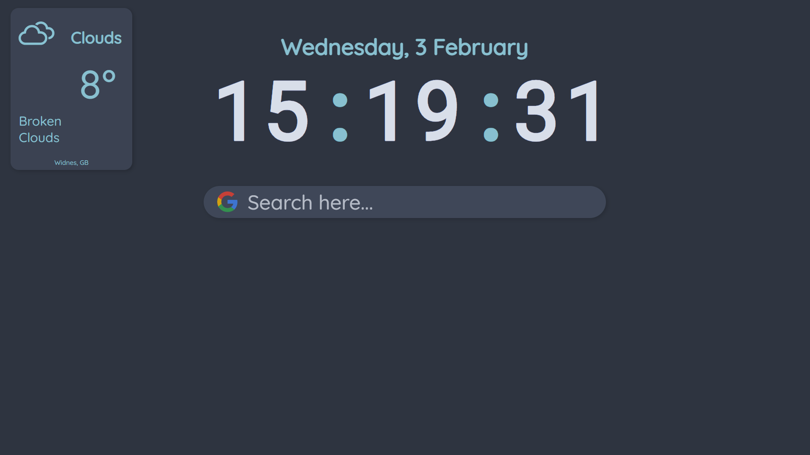
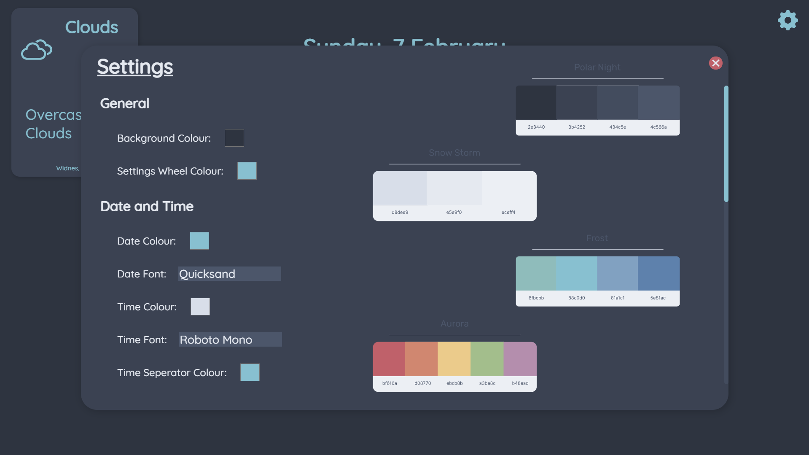

# Nord Landing Page

## Demos   

    
     

## What is this?

This is a simple new tab page using the [nord colour palette](https://www.nordtheme.com/), an arctic, north-bluish color palette which is clean, sleek and readable. This new tab page aims to be simple and minimalist, but still functional. If you find a bug or would like a new feature make sure to create an issue. If you add any new features, feel free to send a pull request over :)   

## Features

-   Weather
-   Time and date
-   Google search bar
-   Google Search suggestions
-   Very easy to edit and customise

### There is much more to come soon.   

## Installation

Configuration options inside of the UI may come at a later date, right now i'm working on adding features. Currently, configuring this means cloning this repository, editing variables and building, but this is very simple.   

1. Clone this repository, either by downloading it as a .zip file or using [git](https://git-scm.com/) and running
   `git clone https://github.com/ahsan-a/nord-landing-page.git`.   
2. Download and install [node.js](https://nodejs.org/en/). After, open the folder in your terminal inside of the project's folder and run `npm install` to install all required node modules. Keep this folder open for now.   
3. Go to [Openweathermap](https://openweathermap.org/), create a new account and generate an API key.   
4. Create a new file called `.env` and add the following values:   
    - `VUE_APP_WEATHERAPIKEY`
    - `VUE_APP_LOCATION`
    - `VUE_APP_UNIT`   
5. Set `VUE_APP_WEATHERAPIKEY` to your openweathermap API key, set your location to your city/town and set your unit to either `metric` or `imperial`, depending on whether you use Celcius or Fahrenheit. An example `.env` file could look like this:   

```
VUE_APP_WEATHERAPIKEY=1234567890abcdef
VUE_APP_LOCATION=London
VUE_APP_UNIT=metric
```   

6. Go back into your terminal and run `npm run serve` to see if everything is working correctly. If everything is working correctly your weather and your location should appear in the box on the top left.   
7. Run `npm run build` to build your project. Your new build should be stored inside of `/dist/index.html`. Set this as your new tab page in your browser settings or using an extension such as [New Tab Redirect](https://chrome.google.com/webstore/detail/new-tab-redirect/icpgjfneehieebagbmdbhnlpiopdcmna/related).   

If you would like to customise, it's as easy as changing the source code.


## Updating
Since there isn't an updating feature yet, just pull from the master branch and recompile.

## Contact
If you need to contact me feel free to add me on discord: ahsan#4403
