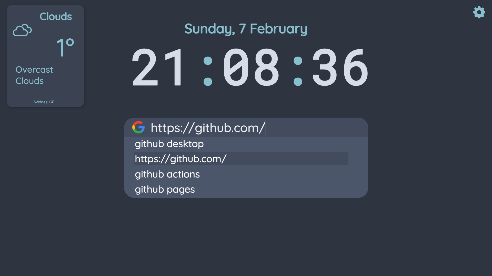

# Nord Landing Page




## What is this?

This is a simple new tab page using the [nord colour palette](https://www.nordtheme.com/) by default. This is an arctic, north-bluish color palette which is clean, sleek and readable. This new tab page aims to be simple and minimalist, but still functional. It's also completely customisable. If you need to change anything else it's really easy to edit the source code and build again. If you find a bug or would like a new feature make sure to create an issue. If you add any new features, feel free to send a pull request over :)

## Features

-   Boasts a minimalist look with a nice Nord theme by default.
-   Completely customisable
-   Minimalist weather, search bar and date/time
-   Free and open sourced
-   Ability to control search bar with arrow keys

### There is much more to come soon.

## Add to Browser and Configure

~~Configuration options inside of the UI will come soon. Currently, the only way to configure is to repository, editing variables and building, but this is very simple.~~

As of 7/2/2021 in brower settings now exist, which are stored inside of your browser's `localStorage`.

Instructions to add:
Inside of your browser settings, add https://nord-landing.herokuapp.com/index.html as your new tab page. If this option does not exist, you can use an extension such as [New Tab Redirect](https://chrome.google.com/webstore/detail/new-tab-redirect/icpgjfneehieebagbmdbhnlpiopdcmna/related), which is the one i use. You can edit all of the prefs by clicking the gear.

To Build and edit source code:

1. Clone this repository, either by downloading it as a .zip file or using [git](https://git-scm.com/) and running

`git clone https://github.com/ahsan-a/nord-landing-page.git`.

2. Download and install [node.js](https://nodejs.org/en/). After, open the folder in your terminal inside of the project's folder and run `npm install` to install all required node modules. Keep this folder open for now.

3. Go to [Openweathermap](https://openweathermap.org/), create a new account and generate an API key.

4. Create a new file called `.env` and add the following value:

-   `VUE_APP_WEATHERAPIKEY`

5. Set `VUE_APP_WEATHERAPIKEY` to your openweathermap API key. An example `.env` file could look like this:

```

VUE_APP_WEATHERAPIKEY=1234567890abcdef

```

6. Go back into your terminal and run `npm run serve` to see if everything is working correctly.

7. After you've finished editing, run `npm run build` to build your project. Your new build should be stored inside of `/dist/index.html`. Set this as your new tab page in your browser settings or using an extension such as [New Tab Redirect](https://chrome.google.com/webstore/detail/new-tab-redirect/icpgjfneehieebagbmdbhnlpiopdcmna/related).

## Roadmap

-   [x] Control search bar with arrow keys
-   [x] Add user preferences
-   [x] Add bookmarks
-   [ ] Maybe add frequently used/recently visited

## Contact

Feel free to add me on discord, it's ahsan#4403 :D
